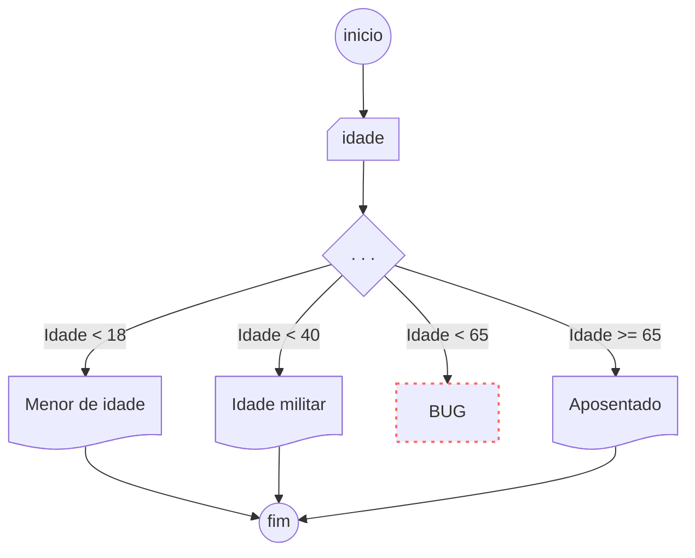

# Introdução aos Algoritmos com Rust

*instrutor Ricardo da Rocha Vitor ricardodarocha@outlook.com  
Atividade Complementar - Curso de Rust
UNIFAGOC - https://unifagoc.edu.br/

Este curso é baseado na página _Stanford's course on programming language theory and design_ [^1]  
Adaptado por Ricardo da Rocha Vitor em 2025-I, com base nos exercícios de Manzano, Lógica para desenvolvimento de programação de computadores.

## Introdução

Rust é uma linguagem de programação moderna, focada em segurança e desempenho. Neste material, aprenderemos os conceitos básicos de lógica de programação utilizando Rust, incluindo blocos principais de código, tomadas de decisão, loops, tipos primitivos e fluxos de controle, como atividades complementares das disciplinas de "Raciocínio Lógico" e "Algoritmos e Estruturas de Dados".

Para ver um exemplo de programa em Rust rodando no browser acesse o notebook do [Rust PlayGround](https://play.rust-lang.org/?version=stable&mode=debug&edition=2024&gist=2614eeb3df6e95cec13c6600a317a251)


## 1. Estrutura Básica de um Programa em Rust

Um programa em Rust sempre começa pela função `main`:

```rust
fn main() {
    println!("Olá, mundo!");
}
```

A função `main` é o ponto de entrada do programa. A macro `println!` imprime uma mensagem na tela.

> Neste curso eu preparei duas macros que permitirão usar `leia!()` e `imprima!()` em vez de `read` e `println!`, dois comandos nativos essenciais em Rust. O objetivo é aproximá-los da didática apresentada pelos autores Manzano e Dantas
> O uso de `read` em Rust é um conteúdo mais avançado, porém o uso de `println!` é bem comum e é importante o seu conhecimento.

## 2. Tipos Primitivos

Rust possui diversos tipos de dados primitivos:

- **Inteiros** (`i8`, `i16`, `i32`, `i64`, `u8`, `u16`, `u32`, `u64`)
- **Ponto flutuante** (`f32`, `f64`)
- **Booleano** (`bool`)
- **Caracteres** (`char`)

Exemplo:

```rust
let inteiro: i32 = 10;
let flutuante: f64 = 3.14;
let booleano: bool = true;
let caractere: char = 'A';
```

---

> Algumas linguagens possuem tipos com nomes diferentes  
> Para renomear os tipos usando os nomes que você já tem familiaridade use o comando `type`;  
> ```rust
> type int = i32;
> type logico = bool;
> ```

### 2.a) declaração de variáveis  

Declare variáveis com o comando **let**  
```rust
let nome = "Santos Dummont";
let nascimento = 1873;
```

> 🔥🔥 **Variáveis mutáveis**  
> Se pretende alterar o valor de uma variável ao longo do processo, lembre de adicionar o prefixo **mut** (mutável)
> ```rust
> let mut idade = 18;  
> idade += 1;
> ```


### 2.b) atribuição de valores

$idade \leftarrow 18$  
Simbologia adotada por Manzano [^2] 

```rust
let idade = 18;
```

> **Outras formas de atribuição**
> ```rust
> let mut idade: i32; //a variável poderá ser modificada
> idade = 1;
> idade += 10; //incrementa
> idade -= 1; //decremento
> asserteq!(idade == 10); //✅
> idade *= 3; //multiplicando por ele mesmo
> asserteq!(idade == 30); //✅
> idade /= 3; //dividindo ele mesmo por 3
> asserteq!(idade == 15); //✅
> ```

### 2.c) comparação lógica

```
== igualdade 
>= maior ou igual
<= menor ou igual
> maior 
< menor 
!= diferente
``` 

```rust
if x == 42 {

}
```

## 3. Blocos de Decisão (Condicionais)

Usamos `if` para tomar decisões:

```rust
fn main() {
    let idade = 26;
    if idade > 18 {
        println!("Maior de idade");
    } else 
        println!("Menor de idade");
    }
}
```

### 3. a) Se

```rust
if idade > 18 {

}
```

### 3. b) Múltiplos Se em sequência


```rust
if numero > m {
	m = numero;
}
if numero < n {
	n = numero;
}
```

### 3. c) Se Senão

```rust
if numero % 2 == 0 {
  print!("É par")
} else {
  print!("É ímpar");
}
```

### 3. c) Se - Senão Se

```rust
if sinal == "vermelho" {
  print!("🔴")
} else if sinal == "amarelo"{
  print!("🟠");
} else {
  print!("🟢");
}
```

### 3. d) Se aninhados

```rust
if numero < 60 {
  if numero > 0 {
    if numero > 41 {
      if numero < 43{
        print!("O número é 42");
      }
    }  
  }
}
```

---

Blocos de decisão também podem ter várias condições
Note que, ao resolver a primeira condição, o sistema não irá percorrer as demais
```rust
    let idade = 160;
    if idade < 18 {
        println!("👶 Menor de idade");
    } else if idade < 100 {
        println!("👨 Maior de idade");
    } else {
        println!("👴 Ancião");
    }
}
```
🚸 Blocos de decisão com mais de duas condições se tornam complexos, sendo a fonte de muitos bugs em programação de sistemas. Um exemplo ocorre ao deixar certas  condições sem tratamento. 

	O código abaixo gera alguns bugs por não considerar 
	corretamente valores entre 40 e 65

```rust    
    // 💣  código contém bug
    let idade = 42;
    if idade < 18 {
	    println!("Menor de idade");
    } else if idade < 40 {
        println!("Idade Militar");
    } else if idade >= 65  {
        println!("Aponsentado");
    }
}
```

O grande problema de códigos deste tipo é que aparentemente não há nada de errado com ele. Como possui uma sintaxe correta, o compilador executa normalmente. 
Analise o diagrama de fluxo com cuidado


Em alguns casos podemos usar `match` para lidar com múltiplas possibilidades, evitando o problema de condições não especificadas:

```rust
fn main() {
    let opcao = 2;
    match opcao {
        1 => println!("Escolheu 1"),
        2 => println!("Escolheu 2"),
        _ => println!("Opção desconhecida"),
    }
}
```

Este padrão de *pattern matching* do rust utiliza o princípio de análise exaustiva, no qual todas as possibilidades devem ser atendidas. Caso haja alguma condição não explicitamente atendida, o compilador emitirá uma alerta;

Veja 

```rust
    let idade: usize = 42;

    match idade {
        0..=17 => println!("Menor de idade"),
        18..=39 => println!("Idade Militar"),
        65..=u32::MAX as u32 => println!("Aposentado"),  
        _ => println!("idade entre 40 e 65, não aposentado"),
    }
```

Se omitir o símbolo _ que representa os demais casos, os programa não irá compilar. Isso ajuda a evitar vários bugs e identificar buracos no código

```
 match idade {
   |           ^^^^^ patterns `40..=u32::MAX` not covered
   |
```
## 4. Laços de Repetição (Loops)

Rust possui três tipos principais de loops:

### 4.1 `loop`

Executa indefinidamente até que um `break` seja encontrado:

```rust
fn main() {
    let mut contador = 0;
    loop {
        if contador >= 5 {
            break;
        }
        println!("Contador: {}", contador);
        contador += 1;
    }
}
```

### 4.2 `while`

Executa enquanto a condição for verdadeira:

```rust
fn main() {
    let mut contador = 0;
    while contador < 5 {
        println!("Contador: {}", contador);
        contador += 1;
    }
}
```

### 4.3 `for`

Itera sobre um intervalo de valores:

```rust
fn main() {
    for i in 1..=5 {
        println!("Número: {}", i);
    }
}
```

## 5. Fluxo de Controle aninhados

Podemos modificar o fluxo de execução usando `break` e `continue`:

```rust
fn main() {
    for i in 1..=10 {
        if i == 5 {
            continue; // Pula o número 5
        }
        if i == 8 {
            break; // Interrompe o loop no número 8
        }
        println!("{}", i);
    }
}
```

## 6. Revisão

```rust
fn main() {
  // Variáveis
  let n: i32 = 1;

  //Constantes
  const pi = 3.14159;

  // Atribuição por inferência
  let n = 1;

  // Sombreamento (Shadowing variable)
  //🚸Atenção, a técnica de sombreamento inutiliza a variável anterior, criando uma nova variável com novo valor
  let n = n + 1;

  // Valores mutáveis
  let mut n = 0;
  n = n + 1;

  // Ponteiros de &str imutáveis
  //🚸Atenção, &str não pode ser mutáveis sem conhecimento de lifetimes (ciclo de vida)
  let s: &str = "Hello world";

  // Strings mutáveis
  let mut s: String = String::from("Olá ");
  s.push_str("mundo!");

  // Tuplas
  let r = 87;
  let g = 13;
  let b = 248;
  let rgb = (r, g, b);

  // uma tupla representando a cor índigo em RGB 🟣
  let indigo  = (87, 13, 248);
  
  // Desestruturação
  let (r, g, b) = indigo;
  println!("r{}, g{}, b{}", r, g, b);

  // Struct para definir estruturas de dados
  struct Coordenada { x: f32, y: f32 };

  // Construtores nativos
  let cc: Coordenada = Coordenada { x: 1.0, y: 2.0 };

  // Acessando os campos
  println!("({}, {})", cc.x, cc.y);

  // Enumerados
  enum PontosCardeais {
		Norte,
		Sul,
		Leste, 
		Oeste
	}

// Genéricos
  struct Numero<T>	{
	valor: T
}

  // Exemplo de uso de genéricos
  let inteiro = Numero<i32> {
	  valor: 89
  }
  
  let real = Numero<f32> {
	  valor: 3.14159
  }

  // Mônadas
  // a) Option
  enum Option<T> { None, Some(T) }
  
  // Mônadas
  // b) Result
  enum Result<T,E> { Ok(T), Err(E) }

  // Constructores para tipos enumerados  
  let valor_opcional: Option<i32> = Option::Some(42);

  // Avaliação exaustiva de Mônadas
  println!("{}", 
	  match valor_opcional {
	    Option::Some(valor) => valor,
	    Option::None => -1
	  });

  // Vetores redimensionáveis
  let mut vetor: Vec<i32> = Vec::new();
  vetor.push(2);
  vetor.push(3);

  // Arrays (Vetores de tamanho fixo)
  let mut array: [i32; 4] = [0, 2, 4, 8];
  arr[0] = -2;
  println!("{}", arr[0] + arr[1]);

  // Slices (fatiando vetores)
  let mut slice: &[i32] = &arr[1..];
  println!("{}", slice.iter().sum::<i32>());

  // Iteradores 
  // Percorrem todos os valores de um vetor ou iterável
  for i in v.iter() {
    println!("{}", i);
  }

  // Loop Infinito (while true).
  let mut i = 0;
  loop {
    i += 1;
    if i == 10 { break; }
  }

  // Loop enquanto a condição for verdadeira
  while i < 20 {
    i += 1;
  }
}

// Funções
fn fib(n: i32) -> i32 {
  if n <= 1 { n } else { fib(n-1) + fib(n-2) }
}
```

## Conclusão

Rust é uma linguagem poderosa para a lógica de programação. Compreender a estrutura do código, decisões condicionais, loops e fluxo de controle é essencial para desenvolver programas eficientes. Aprender Rust desde cedo pode ser um divisor de águas na carreira do programador, pois a forma estruturada e o compilador bastante exigente poderá auxiliar na construção de programas mais sólidos e hábitos mais saudáveis como tipagem estática, ciclo de vida de variáveis, imutabilidade etc.

# Referências

[^1]: [Stanford's course on programming language theory and design](https://stanford-cs242.github.io/f19/labs/rust.html)

[^2]: [MANZANO, Augusto. Algoritmos. Lógica Para Desenvolvimento de Programação](https://www.amazon.com.br/Algoritmos-L%C3%B3gica-Para-Desenvolvimento-Programa%C3%A7%C3%A3o/dp/8536502215)

[MANZANO, Augusto. **Primeiros passos com a linguagem Rust**](https://www.amazon.com.br/Primeiros-passos-com-linguagem-Rust-ebook/dp/B07DV3CF14)

[A linguagem de programação Rust](https://rust-br.github.io/rust-book-pt-br/title-page.html)
