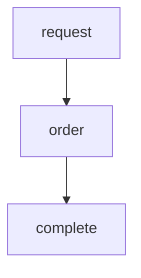

# Um guia de Design Patterns com Rust

Neste repositório eu explico e mostro exemplos de design pattern com RUST. 
Antes de sair por aí implementando design patterns, é recomendável entender [quando não fazê-lo](https://rust-unofficial.github.io/patterns/patterns/index.html)   
## O Padrão Builder e o Dialeto Fluent

💬 Utilizar a linguagem ubíqua é a forma mais recomendada para você escrever o ponto de entrada para a sua aplicação `main.rs` `lib.rs`

```Rust
fn main() {
  HttpServer::new( move || {
        let logger = Logger::default();
        App::new()
        .data( pool.clone() )
        .wrap(logger)
        .service(ping)
        .service(pong)
}
```

Este formato é possível na linguagem funcional se você escrever implementações como funções que retornam a si mesmo (Self)

✨ **Rust possui suporte nativo** ao padrão Builder por meio da macro **derive_builder**


```Rust
#[macro_use]
extern crate derive_builder;

#[derive(Default, Builder)]
#[builder(setter(build))]
struct pub struct Server {
  host: String,
  port: u16,
  timeout: Option<ms>,
  }
}
```
✨ Esta simples expansão irá permitir construir uma nova instância de Server assim

```Rust
let serv = ServerBuilder::default()
.host("localhost".to_owned),
.port(9090),
.timeout(3000):
.build()
.unwrap();
```

👶 No entanto se você é iniciante eu recomendo implementar este design patter com as suas próprias mãos:

```Rust
impl App{
  fn atribuir(&mut self, valor: any) --> &mut Self {
  self.any = any;  
  return self
}
```

🎯 Idiomaticamente é recomendável escrever estruturas com responsabilidades específicas, criando um struct específico para construir (Builder) uma estrutura Comportamental (Business)

```Rust
pub struct Server {
  host: String,
  port: u16,
  timeout: Option<ms>,
  }
  
  impl Server {
    fn index() -> HttpResponse {
    return Ok('<div> Olá Mundo </div>'.to_owned())
    }
    
 -------------
 
pub struct ServerBuilder {
  host: String,
  port: u16,
  timeout: Option<ms>,
  }
 

  impl ServerBuilder {
    fn host(&mut self, host: String) -> &mut Self {
      self.host = host;
      return self
    }
    fn port(&mut self, port: u16) -> &mut Self {
      self.port = port;
      return self
    }
    fn timeout(&mut self, value: i32) -> &mut Self {
      self.timeout = ms(value);
      return self
    }
    fn build(&mut self2) -> Server {
      return Server {self.host, self.port, self.timeout}
    }
}

```

https://www.youtube.com/watch?v=5DWU-56mjmg&t=419s _em inglês_

## Iterator

Iterar é uma das habilidades mais importantes das linguagens de programação
Vamos revisar as estruturas de looping disponíveis pela linguagem Rust

```
loop {
};

for _ in 0..10 { }
```

o _Design Pattern_ **iterator** é uma expansão deste conceito que utiliza alguns recursos mais avançados para ampliar as possibilidades de programação, a segurança e a performance.
Observe o código Rust para separar uma string simples

```Rust
let todos_meses_do_ano = "Janeiro, Fevereiro, Março, Abril, Maio, Junho, Julho, Agosto, Setembro, Outubro, Novembro, Dezembro";
let meses: Vec<&str> = 
todos_meses_do_ano.split(',')
 .map(str::trim)
 .collect();
 ```
 
 Observe que o método map é chamado para cada elemento do iterador _split_  
Split é um iterador porque implementa o `trait Iterator` que possui a seguinte estrutura

```Rust
trait Iterator<T> {
    fn next(&mut self) -> Option<T>;
    fn current(&self) -> Option<T>;
    fn has_next(&self) -> bool;
    fn reset(&mut self);
}
```

Saiba mais em https://github.com/lpxxn/rust-design-pattern/blob/master/behavioral/iterator.rs

## Observer

Observer utiliza uma estrutura de Notificadores e Assinantes  
Um Notificador é um detentor de uma informação ou um Agente capaz de informar um ou mais assinante quando houver uma novidade, ou após a modificação do estado de uma aplicação.

Podemos exemplificar o Observer como um banco de dados REDIS que irá disparar uma notificação para as aplicações CLIENT quando for inserido um novo item no banco de dados, por exemplo. No entanto este design pattern será implementado inteiramente numa mesma camada da aplicação.

### Caso prático

Imagine que uma aplicação que monitore o preço das ações na Bolsa de Valores  
Sempre que uma ação da Bolsa de valores cair ou subir, irá notificar os clientes que possuem aquela ação na sua carteira.  
No entanto para não ter problemas de tráfego, a aplicação irá notificar apenas as 100 ações com alterações mais relevantes

A representação deste aplicativo ficaria assim

```Rust
impl Notificador {

fn Notificar(assinantes Vec<Assinante>) {
for acao in acoes
  assinantes(acao).notify(acao)
  }

fn Assinar(assinante, acao) {
  Self.assinantes(acao).push(assinante)
  }
}
```

```Rust
impl Assinante {

fn Assinar(notificador: Notificador; acoes: Acao)
for acao in acoes
  notificador.assinar(Self, acao)
  }
```


```Rust
use std::rc::Weak;

struct Event;

trait Observable {
    fn register(&mut self, observer: Weak<dyn Observer>);
}

trait Observer {
    fn notify(&self, event: &Event);
}
```
---
## State

State é um design pattern que admite que um determinado objeto possua uma variável de estado que representa diferentes estados em que o objeto se encontra.
Também admite que há um fluxo predefinido onde um objeto que está em um determinado estado irá percorrer uma sequência lógica, e que esta sequência contém algumas regras específicos sobre quais estados são permitidos no próximo estágio, e quais não.

🚩 Por exemplo, uma invoice pode representar o estado padrão de uma operação de compra de uma mercadoria. Podemos ilustrar o fluxo assim


Note que não é possível uma **request** passar diretamente para o estado de **complete**  
Primeiro é necessário receber aprovação, que é representado pelo estado **order**

🦀 Implementar o design pattern State em Rust exatamente como é recomendado para Programação Orientada a Objetos (POO) não irá tirar proveito dos recursos Rust, em vez disso é recomendada uma abordagem mais rustácea:

```Rust
pub struct Request {
  product_id: String,
  quant: u16 }
  
pub struct Order {
  product_id: String,
  quant: u16 }
  
pub struct Invoice {
  product_id: String,
  quant: u16 }
  price: f16,
  tax: f16}
  
impl Request {
  fn new(id: String, quant: u16) -> Request {
  Request{
  product_id: id,
  quant: quant,
    }
  }
  fn approve(self, quant: u16) -> Order {
  Order{
  product_id: self.id,
  quant: quant,
  }
}

impl Order {
  fn complete(&mut ord: Order, price: f16, tax: f16) -> Invoice {
  Invoice{
  product_id: ord.id,
  quant: ord.quant,
  price: price,
  tax: tax
  }
}
}
```

🧐 Eu também preparei esta abordagem utilizando Enum. A implementação fica assim

```Rust
enum Invoice {
  Request(String, u16, ), 
  Order(String, u16, ),
  Invoice(String, u16, f32, f32, ),
}

impl Invoice {

    fn approve(self, quant: u16,) -> Invoice {
        match self {
            Invoice::Request(product_id, _) => return Invoice::Order(product_id.to_string(), quant),
            _ => return self
        }
    }
    
    fn complete(self, price: f32, tax: f32) -> Invoice {
        match self {
            Invoice::Order(product_id, quant) => return Invoice::Invoice(product_id.to_string(), quant, price, tax),
            _ => return self
        }
    }
} 

fn main() {
    let request = Invoice::Request("031ac51c".to_owned(), 2_000);
    let order = request.approve(1_500);
    let _invoice = order.complete(19.90, 127.00);
    
}
```
