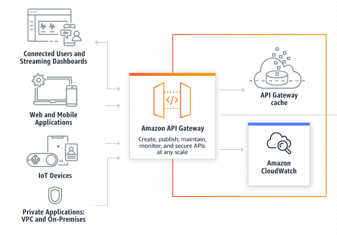
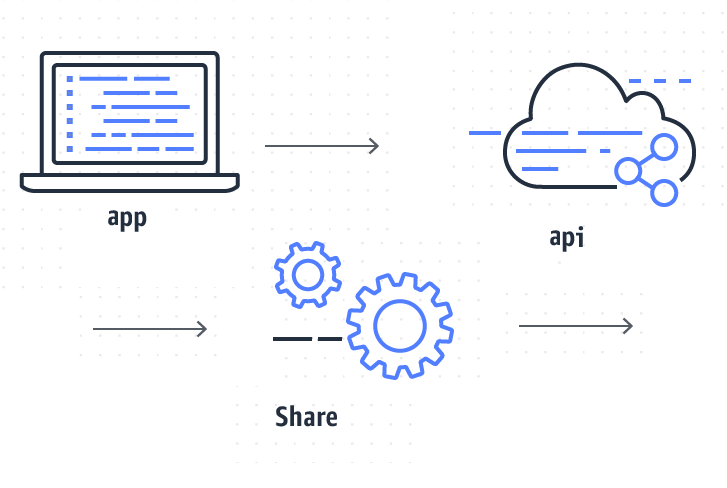
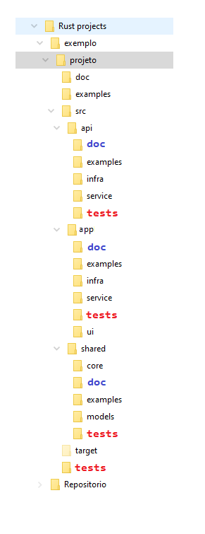
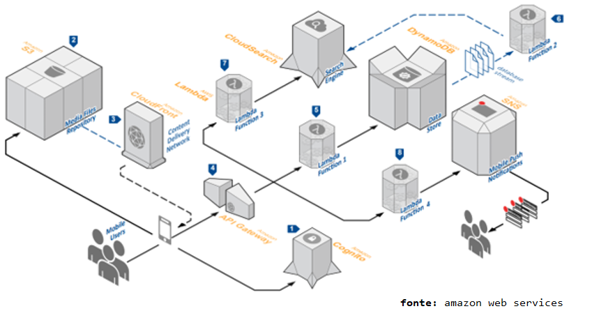
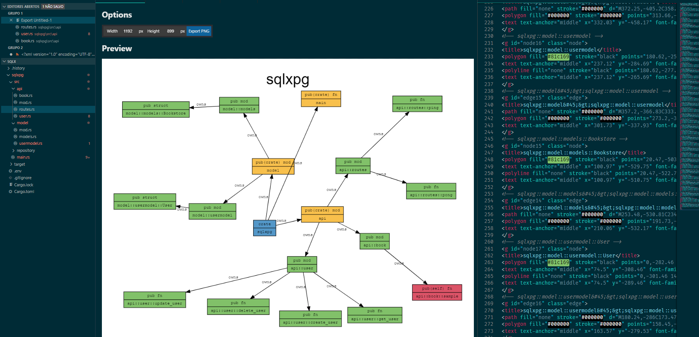
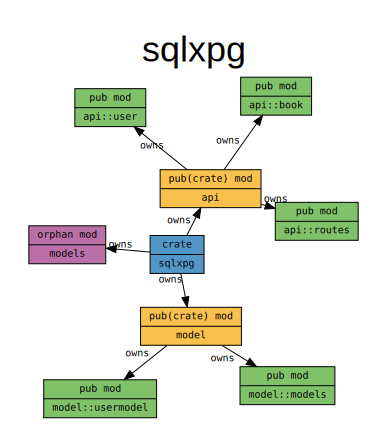

# Introdução à Arquitetura de Projetos com Rust



Neste repositório eu demonstro como planejar a sua aplicação em diretórios, baseado na funcionalidade e na modularização

Alguns princípios que você deve estar atento ao elaborar uma Arquitetura de Projeto

- [x] Modularizção
- [x] Organização e Estrutura de Pastas 
- [x] Nomenclaturas claras e Identificação correta
- [x] Aplicação de Design Patterns

Se você organizar bem o seu código, você terá menos trabalho para encontrar os arquivos, para dar manutenção e reaproveitar as funcionalidades que você criou.

- [x] Reaproveitamento de código
- [x] Facilidade para encontrar o que deseja
- [x] Alta produtividade

acesse a minha curadoria de projetos Rust com base na arquitetura
[Projetos Rust](https://github.com/ricardodarocha/Rust/tree/main/Curadoria)
[Design patterns em Rust](https://github.com/ricardodarocha/Rust/tree/main/DesignPattern)

## Criando uma estrutura de Projetos



Embora não se possa dizer que esta estrutura de pastas seja realmente eficiente em 100% dos casos, eu acho que é um excelente ponto de partida para você começar a estudar Rust e organizar sua aplicação em módulos
Se deseja um estudo mais profundo de como organizar sua própria estrutura, consulte o tópico Analisando minha estrutura de projetos

```
projeto
├── doc
│   ├── swagger
│   ├── mkdocs-material
│   └── docs # Rust Generated Docs
├── examples
├── src
│   ├── bin.rs
│   ├── main.rs
│   ├── api
│   │   ├── 
│   │── app
│   │   ├── 
│   └── shared
│       ├── 
├── target
└── tests
```

## Aplicação em camadas

Uma aplicação em camadas é a maneira mais simples de compartilhar código
Imagine que você queira formar uma startup possuindo uma aplicação MVP (Miminum Value Product) que é o menor modelo de negócios que você possa criar para atender a um problema específico.
É bem comum que você possua uma divisão em camadas, com uma aplicação na nuvem (api) e outras aplicações (aplicativos, apps) que vão rodar no computador dos clientes, no browser ou no celular.

Um ponto importante é que muito provavelmente **há aspcetos compartilhados** tanto da regra de negócios como dos models.
Vamos esclarecer estes termos

### Regra de Negócios / Core

Muitas vezes chamado **Core** da aplicação, a regra de negócios utiliza a **linguagem ubíqua** para representar o problema no mundo real.

```
with user do
  select * from users as user where username = ?username
then
   if user.contais > 1 then error('Vários usuáros com o mesmo login')
   else if user.contais = 0 then error('Usuário não encontrado')
   else if user.password = ?password then
      return logged
   else 
      return 'invalid password'
```
Esta lógica pode ser encapsulada em várias classes (POO) ou Structs e Functions, vai depender do paradigma de programação que você está usando.
O Ponto importante é que muitas vezes uma regra de negócios poderá ser compartilhada entre vários aplicativos, neste caso é recomendável colocar estas regras de negócio em um módulo compartilhado (pasta shared)

### Models

Quando temos dados armazenados em arquivos ou no banco de dados, ou quando criamos entidades para representar os dados da aplicação, podemos criar structs que ficam em um módulo especial chamado Models

Models representa as entidades e os atributos destas entidades.

```Rust
pub struct User {
    pub id: i32,
    pub nome: String,
    pub email: String,
    pub senha: String
}
```
Os models também podem ser compartilhados com várias aplicações, (pasta shared)  
Embora em alguns casos seja recomendado escrever models específicos para cada aplicação (pastas específicas de cada aplicação)

Observe o conteúdo da pasta **src** abaixo

```shell
└── src
    ├── api
    │   ├── 
    │── app
    │   ├── 
    └── shared
        ├── 
```



## Pastas padrões

**src** é a pasta gerado pelo Rust cargo, onde contém todo o código fonte do seu projeto  
**target** é a pasta padrão onde cargo irá gerar os binários


## Outras pastas

### Infra

Infra normalmente é uma pasta onde implementamos algums recursos concretos da aplicação  
Imagina que nossa aplicação possua um serviço de autenticação, mas com o passar do tempo podemos mudar de ideia e encontrar uma lib de autenticação mais eficinte, mais rápida ou menos vulnerável a falhas de segurança.
Neste caso podemos subsituir este componente sem reescrever toda a aplicação, apenas a parte de importar o componente e escrever um adaptador específico será repada, o core da aplicação continuará funcionando com o mesmo comportamento (regra de negócios)

### Testes

Uma maneira de garantir que aplicação irá continuar funcionando adequadamente é escrevendo testes. Uma programação orientada a testes **tdd** é cada vez mais empregada e os testes podem ser facilmente escritos em rust.

Você pode criar testes no próprio código fonte, no entanto um diretório de testes centralizados é altamente recomendável.
A camada de testes irá ajudar que a camada de infra sofra alterações de manutenção por exemplo, sem quebrar o comportamento padrão esperado.
Também irá garantir que determinadas atualizações das libs não afetem a aplicação, e quando for o caso poderão rapidamente ser detectadas e revertidas para a versão estável.

# Arquiteturas complexas

Com o tempo você irá compreender melhor a estrutura dos projetos e escolher a arquitetura mais adequada. Muitas vezes você irá ver a própria arquitetura se modificar, até atingir elementos bem avançados que melhor irão atender as suas expectativas e às necessidades da sua aplicação

Exemplo de uma arquitetura distribuída na nuvem
Cada lambda poderá ser escrito como um microsserviço, em linguagems diferentes, hospedados em serviços diferentes na nuvem



# Cargo modules

##  Analisando minha estrutura de projetos

 O primeiro passo para analisar a sua estrutura de projetos atual é instalando o pacote de análise cargo-modules
 
 ```Rust
cargo install cargo-modules
cargo modules generate tree
```

O comando `generate tree` irá produzir uma estrutura de pastas do seu projeto, como no exemplo
```
crate apipg
├── mod api: pub(crate)
│   ├── mod customer: pub
│   ├── mod routes: pub
│   └── mod user: pub
└── mod model: pub(crate)
    ├── mod models: pub
    ├── mod usermodel: pub
    └── mod customermodel: pub
```

o comando `cargo modules generate tree —with-types` **--with-types** irá gerar uma árvore mais detalhada, incluindo as Struct públicas e privadas da sua aplicação

```Rust
cargo modules generate tree —with-types
//output>
```

``` 
crate sqlxpg
├── mod api: pub(crate)
│   ├── mod book: pub
│   │   └── fn sample: pub(self)
│   ├── mod routes: pub
│   │   ├── fn ping: pub
│   │   ├── fn pong: pub
│   │   └── fn user: pub
│   └── mod user: pub
│       ├── fn create_user: pub
│       ├── fn delete_user: pub
│       └── fn update_user: pub
├── fn main: pub(crate)
└── mod model: pub(crate)
    ├── mod models: pub
    │   └── struct Bookstore: pub
    └── mod usermodel: pub
        └── struct User: pub
```

## Gerando Grafos 

Esta funcionalidade vai revolucionar a sua visão de arquitetura de projetos com Rust (E também com outras linguagens)  
Instale a aplicação para visualizar grafos [**Graphviz**](https://graphviz.org/download/) (Open Source, Free to download)  


Após instalar você poderá executar o verificador utilizando o parametro

```Rust
cargo-modules generate graph --with-types --with-tests --with-orphans | "d:/programas/graphviz/dot.exe" -Tsvg > diagrama.svg
```
Observe que você precisa informar o local onde foi instalado o executável "dot.exe" e passar o parametro -Tsvg  
o parâmetro `> diagrama.svg` exporta o resultado para um arquivo .svg, que voce pode visualizar utilizando o Browser

Dica instale a extensão [**svg Viewer**](https://marketplace.visualstudio.com/items?itemName=cssho.vscode-svgviewer) para visualizar o grafo no VSCode.



